# 大模型工程化建设概览

!!! note 
    {width="30px" height="25px"} _当大家都去挖金矿时，卖铲子的最赚钱_

## 大模型发展

大模型即「大规模预训练模型」，其研究聚焦于两个核心命题：**模型训练**与**推理优化**；

**训练**：通过优化模型参数，使损失函数最小化，以提升推理结果的准确性；

> 关键转折点：2020年后，大模型借助无需标注的文本数据和GPU算力，实现参数规模与性能的指数级提升

**推理**：基于预训练模型的固定参数（模型），对新输入数据进行预测或生成输出；

> 随着技术成熟，AI基础设施（AI Infra）成为行业关注焦点

## 工程实践

在没有“铲子”的情况下，如何使用大模型技术来构建自己的应用；


> [https://antoss-landscape.my.canva.site/](https://antoss-landscape.my.canva.site/)

### Transformer回顾

回顾transformer中的核心公式：

1.  **自注意力机制（Self-Attention）**
    
    
    
    
    
    
    
2.  **前馈网络（FFN）**
    
    
    
3.  **残差连接（Residual Connection）**
    

通过跳跃连接缓解梯度消失问题：

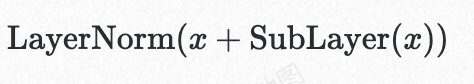


### 基础设施建设（AI Infra）

#### 模型训练

模型训练主要分为两个阶段：**预训练阶段**和**微调阶段**；

**预训练阶段**：在大规模的无标签数据集上接受训练，目标是使模型掌握语言的统计特征和基础知识。预训练实质上是一种无监督学习过程，完成预训练的模型被称为**基座模型（Base Model）**；

**微调阶段**：在部分情况下基础模型提供的泛化能力并不满足特定垂直领域在专业知识、性能等方面的诉求，会在针对性的任务数据集上接受更进一步的训练，这一阶段主要涉及对**模型权重的细微调整**；

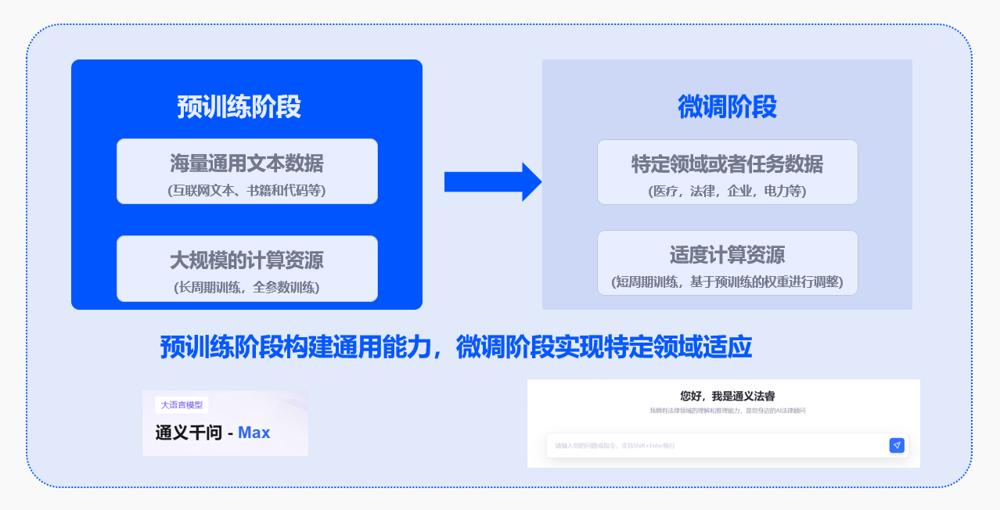

##### 模型微调（Fine-Tuning）

常见的微调类型包括：

**Prefix-Tuning/P-Tuning/Prompt-Tuning**：通过可学习前缀或连续提示调整注意力机制，会减少最大序列长度；

**Adapter-Tuning**：在模型层间插入适配器模块（小型神经网络），会引入推理延迟；

**LoRA（Low-Rank Adaptation）**：低秩矩阵分解，参数量仅0.1%-1%；通过向**模型权重矩阵**添加低秩矩阵来进行微调，**既允许模型学习新的任务特定模式，又能够保留大部分预训练知识**，从而降低过拟合风险并提高训练效率；

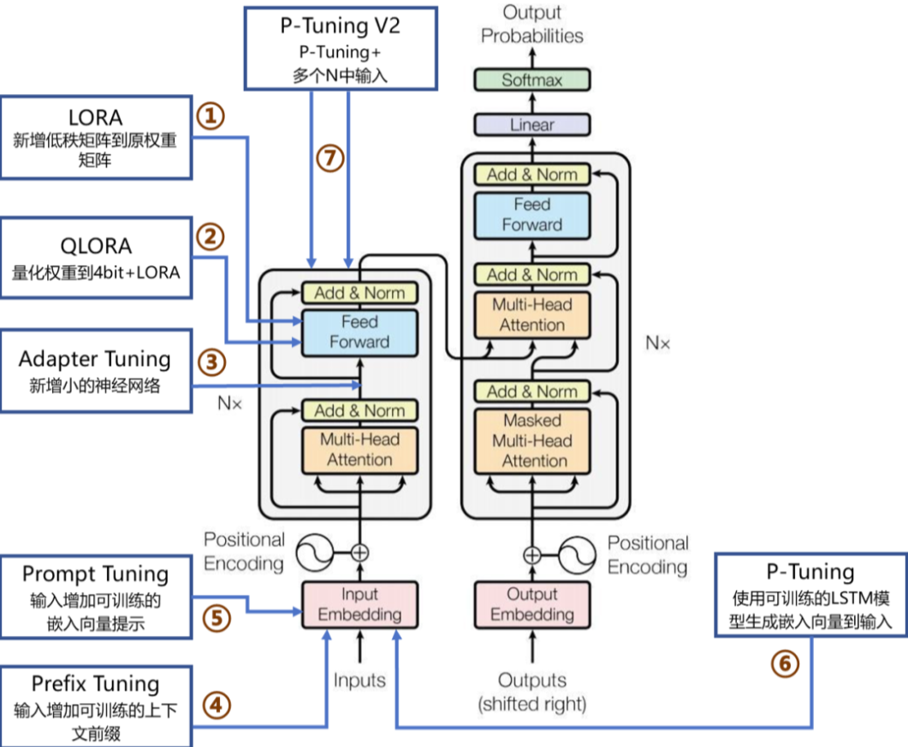

##### LoRA/QLoRA

**基本概念**

**（向量）线性无关**：一组向量 线性无关，当且仅当 **没有任何一个向量能通过其他向量的线性组合** 表示出来，即：

$c_1v_1+c_2v_2+···+c_nv_n = 0$，当且仅当$c_i=0$时成立；

**矩阵的秩**：其行（或列）向量组的极大线性无关组的个数

*   **满秩矩阵（Full-Rank）****：**一个矩阵的秩 = 其行/列数中的较小值
    
    *   Q,K,V线性变换矩阵或前馈网络的全连接层通常是满秩的，因为它们需要捕捉数据中的复杂特征且尽量减少冗余；
        
*   **低秩矩阵（Low-Rank）**：一个矩阵的秩 < 其行/列数中的较小值;
    

> 直观理解：

> 满秩：每个向量都提供了“独一无二”的信息，无法被其他向量替代；

> 低秩：至少有一个向量可以被其他向量“替代”，存在冗余；

**LoRA（低秩适配器）**

> [LoRA: Low-Rank Adaptation of Large Language Models](https://arxiv.org/abs/2106.09685)

主要思想是冻结预训练模型的权重，并在每个 Transformer 块中添加一个可训练的层，即旁路矩阵 A 和 B；

**低秩分解**：其核心思想是将一个高维矩阵 **近似表示为两个或多个低秩矩阵的乘积**，从而在保持大部分信息的前提下，**显著降低参数规模和前向传播的计算复杂度**；

> **理论支撑：大模型训练中****即使在随机投影到较小子空间后，仍然可以高效学习；**[Intrinsic Dimensionality Explains the Effectiveness of Language Model Fine-Tuning](https://arxiv.org/abs/2012.13255)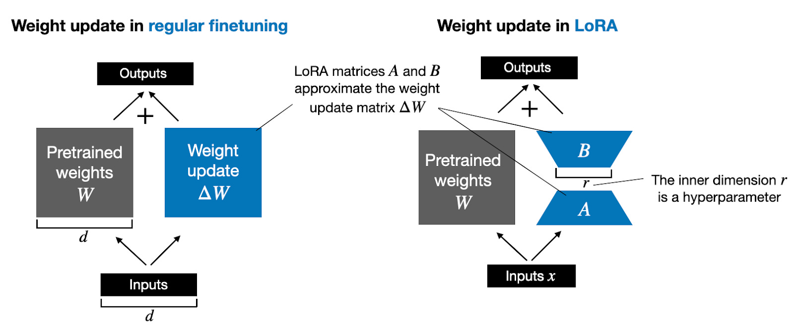


假设预训练权重矩阵$W_0\in\Reals^{d*k}$，而微调过程就是要寻找$W=W_0 + \vartriangle W$中的$\vartriangle W$，通过低秩分解可得到如下公式：

$W=W_0 + BA$，其中 $B\in\Reals^{d*r}$、$A\in\Reals^{r*k}$，$r\ll min(d,k)$为低秩矩阵的秩；

*   **参数规模：**$d*k$ **-->** $r*(d+k)$
    
*   **计算复杂度：**$\vartriangle W * x$ **-->** $BAx$**\=** $O(dk)$ **-->** $O(d*r+r*k))$
    

在训练过程中$W_0$被冻结，不接受梯度更新，而$A$和$B$包含可训练参数，**在**$r$**足够小的时候可以显著降低训练的计算复杂度**；

**训练过程**


> 参考：[https://zhuanlan.zhihu.com/p/702629428](https://zhuanlan.zhihu.com/p/702629428)

其中，$\partial L$表示损失函数，$\partial x$表示输入，$\partial h$表示输出，通过反向传播公式变换得出：

$\frac {\partial L}  {\partial x} =  \frac {\partial L}  {\partial h} \frac {\partial h}  {\partial x} = \frac {\partial L}  {\partial h}(W_0 + BA)$，输入$\partial x$和输出$\partial h$基于训练数据是已知的，$W_0$为预训练的权重矩阵固定不变，则可以根据预设的$\partial L$反推出微调参数矩阵$A$和$B$；

**反向传播**：从损失函数出发，利用链式法则逐层计算梯度，更新模型参数；

**训练结果**

得到低秩矩阵$A$和$B$，并保存为单独的层，可按需加载；

**QLoRA（量化LoRA）**

> [QLoRA: Efficient Finetuning of Quantized LLMs](https://arxiv.org/abs/2305.14314)

牺牲参数的精度来降低显存消耗，提升训练效率，在推理部分重点介绍；

##### 工程实现

!!! note 参考
    _以下参考的是：_[LLaMA-Factory](https://llamafactory.readthedocs.io/zh-cn/latest/#)

LLaMA-Factory：一个简单易用且高效的大型语言模型（Large Language Model）训练与微调平台，可通过简单的参数配置进行模型微调；

```shell
.
├── data           -- 训练数据集
├── evaluation
├── examples       -- 参考示例
├── pyproject.toml
├── requirements.txt
├── scripts
├── setup.py       -- 安装脚本
├── src            -- 源代码
```

常用的3个命令：

!!! note 微调
    llamafactory-cli train examples/train\_lora/llama3\_lora\_sft.yaml   -- 微调

    llamafactory-cli chat examples/inference/llama3\_lora\_sft.yaml   -- 对话

    llamafactory-cli export examples/merge\_lora/llama3\_lora\_sft.yaml   -- LoRA微调合并（非必需）


>[ModelScope](https://modelscope.cn/docs/notebooks/intro)平台限时免费的资源，可以体验模型训练的过程

#### 模型推理（LLM Inference）

大模型本质上只是训练好的参数、数据，需要借助硬件支持、推理引擎的能力提供服务；

!!! note 参考
    _以下参考的是：_[A Survey on Efficient Inference for Large Language Models](https://arxiv.org/abs/2404.14294)

传统 Transformer 模型是建立在编码器-解码器架构上，由两个 Transformer 块分别作为编码器和解码器，常见架构：

*   **Encoder-Only**：BERT、ViT（图像分类）
    
*   **Decoder-Only**：GPT系列、LLaMA
    
*   **Encoder-Decoder**：原始Transformer（翻译）、T5、BART
    

目前主流的模型（如GPT、LLaMA、Qwen）都是基于**Decoder-Only**架构实现的，在训练效率和工程实现都有较大的优势；

##### Decoder-Only推理引擎

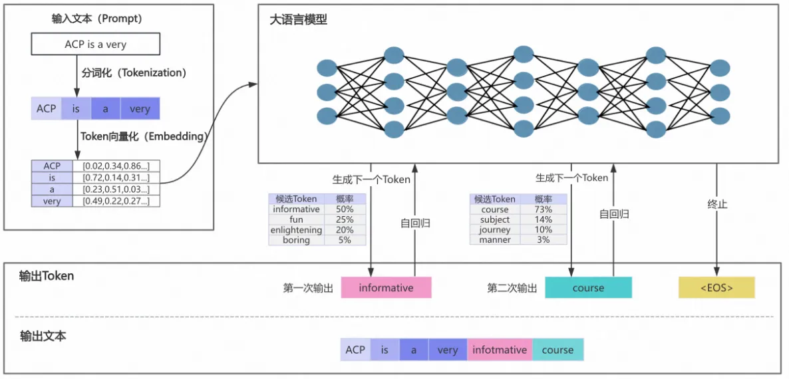

目前市面上的开源、自研类的推理引擎有很多，主要的流程分为两个阶段：

**预填充（Prefilling）阶段**：

1.  **分词（Tokenizer）**
    
    将用户输入文本通过分词器（tokenizer）转换为数字token序列，
    
    `输入："你好" -> [2345, 6789]`
    
2.  **词嵌入（Embedding）**
    
    将token转换为高维向量（张量），并叠加位置编码，形成模型可处理的输入；
    
3.  _**初始KV缓存（First Token）**_
    
    _计算并存储初始输入的KV缓存，生成首个输出token__；（基于KV Cache机制定义）_
    
    **解码（Decoding）阶段**：
    
4.  **自回归过程（Decode）**
    
    Transformer解码器自回归执行过程，LLM生成的核心过程，经过自注意力、FNN等流程，具体参考Transformer基本原理；
    
5.  **采样策略（Sampling）**
    

基于概率分布选择token，支持：

*   Top-k采样：仅保留概率最高的k个token
    

*   Top-p（核采样）：保留累积概率达p的token
    

*   Temperature调节：控制输出的随机性（temperature=1为默认）
    

1.  **结果生成（Output）**
    

将token序列转换回文本，追加至输出结果；


> 推理引擎各阶段开销，参考：[https://arxiv.org/pdf/2404.14294](https://arxiv.org/pdf/2404.14294)

##### 推理优化

推理优化技术是大模型落地应用的关键，涉及的知识面很广，相关技术论文整合：[Awesome-LLM-Inference](https://github.com/xlite-dev/Awesome-LLM-Inference?tab=readme-ov-file#awesome-llm-inference-papers-with-codes)

###### KV-Cache

用于缓存自注意力机制的中间结果（K和V矩阵）的优化技术，主要用于生成式模型推理阶段；是一种以空间换时间、动态规划的思路的优化策略；

*   传统方式：每次计算时需重新计算所有历史K和V，时间复杂度为$O(n^2)$；
    
*   KV-Cache优化：
    
    *   **缓存K和V**：仅存储历史注意力计算结果，空间复杂度为$O(n)$；
        
    *   **增量计算**：新token仅需与当前K、V进行交互，时间复杂度降为$O(n)$；
        

**数学解释**

回到自注意力计算公式：

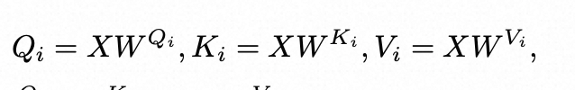

，

我们暂且先忽略掉$\sqrt{\smash[b]{d_k}}$的影响，可以有以下的矩阵计算过程：


在实际的推理过程中为了避免推理过程中看到未来的位置，还会设计一个**因果掩码（Causal Mask）**来加入计算，公式更改为：

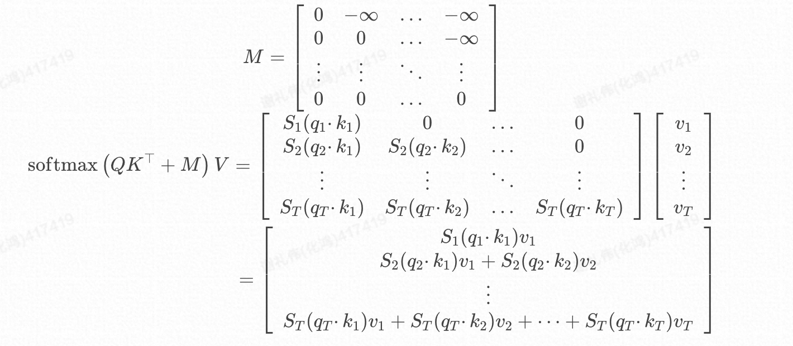

由此可见对于位置T，除了$q\_T$参与计算，K、V位置T及其之前的均要参与计算，**所以无需缓存Q，却需要缓存K、V**；

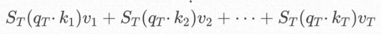

**KV Cache 的工作流程**

预填充（Prefilling）阶段：根据输入Tokens，逐一生成对应的K、V并缓存；

解码（Decoding）阶段：在自回归生成后续Token时，仅需计算当前token的K、V并缓存，并且复用已经缓存的K、V用于最新的注意力计算；


> 参考：[探秘Transformer系列之（20）--- KV Cache](https://www.cnblogs.com/rossiXYZ/p/18799503#23-%E9%87%8D%E6%96%B0%E5%AE%9A%E4%B9%89%E9%98%B6%E6%AE%B5)

**显存上的挑战**

以Qwen2.5-7B-Instruct模型为例，最大Token长度为32768，单次请求 KV Cache消耗的最大显存：


常见的优化手段，内存分片、压缩、碎片整理（[PageAttention](https://arxiv.org/abs/2309.06180)）、量化等技术；

###### 量化

> 在本地化、边缘计算场景的部署方案中大多会用到量化的技术

**原理**：将模型权重从FP32（32位浮点）压缩到低精度（如FP16、INT8、INT4甚至二值化），平衡精度与效率；（$W*x+b$，将$W$、$b$参数转换成半精度（BF）、整数表示）；

**效果**：减少内存占用（如INT8可压缩4倍），加速计算（尤其在支持低精度的硬件上）。

**量化的对象：权重、KV Cache等**

**基础原理**

根据每个tensor的浮点型最大值和最小值，将其映射为一个固定范围的整形数值集合，比如[-127~127]；

**$W_q=round(W/scale + zeropoint)$**

其中$W_q$代表量化后权重，$W$代表量化前权重

*   scale代表缩放因子，表示浮点数与整数的缩放比例；
    

*   zeropoint表示零点，用于非对称量化时的偏移补偿；
    

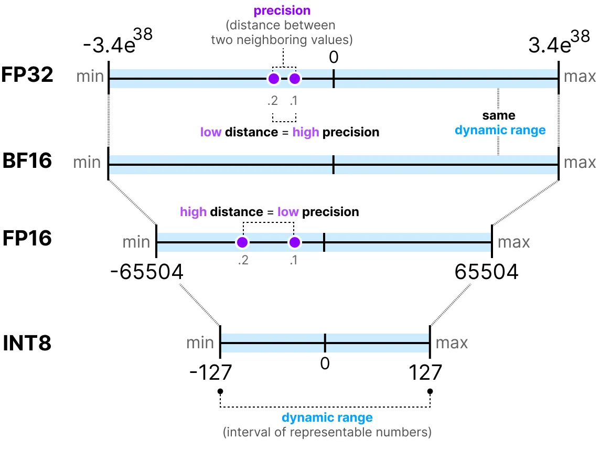

// TODO 量化处理过程

bitsandbytes：[https://arxiv.org/pdf/2110.02861](https://arxiv.org/pdf/2110.02861)、[项目地址](https://github.com/bitsandbytes-foundation/bitsandbytes)

##### 模型部署

!!! note 参考
    _参考的是本地化部署工具_[Ollama](https://github.com/ollama/ollama)，类似的框架还有[vllm](https://github.com/vllm-project/vllm)


Ollama采用分层设计，借鉴Docker的交互理念，分为两层：

1.  **用户层（Ollama Server）**：面向用户，提供简洁易用的接口封装，降低使用门槛。
    
2.  **推理层（llama Server）**：通过cgo调用C++实现的**llama.cpp**推理引擎，结合GGML库的量化技术优化模型推理，减少内存占用并提升速度（支持本地化部署）。

[GGML](https://huggingface.co/blog/introduction-to-ggml)：C语言开发的张量库，支持模型量化，实现轻量化推理；[参考2](https://github.com/Yangxiaoz/GGML-Tutorial/blob/main/doc/Core-Concepts.md)、[参考3](https://zgh551.github.io/2025/02/15/llama-cpp-ggml/)

[GGUF](https://github.com/ggml-org/ggml/blob/master/docs/gguf.md)：模型存储格式，用于高效保存和加载适配GGML推理的模型数据。[参考1](https://zgh551.github.io/2025/02/15/llama-cpp-ggml/)

支持的量化方式：[https://zhuanlan.zhihu.com/p/12729759086](https://zhuanlan.zhihu.com/p/12729759086)

### 平台化（Paas）

模型训练和推理优化属于大模型基础设置（AI Infra）的范畴，在Paas主要的命题是如何将大模型的推理能力提供用户，支持用户快速构建应用；常见的两种范式（系统）是Agent、Workflow；

#### Agent


> [https://lilianweng.github.io/posts/2023-06-23-agent/](https://lilianweng.github.io/posts/2023-06-23-agent/)

| 组件 | 作用 | 落地场景 |
| --- | --- | --- |
| 上下文记忆（Memory） | 负责上下文信息的管理和查询 | 多轮对话、RAG等 |
| 推理/规划（Reason/Planning） | 负责推理、任务的拆解和规划 | 各种LLM（Agent的大脑） |
| 动作/工具（Action/Tool） | 负责LLM与外部环境沟通、交互 | 通过Function Calling技术调用 |

##### React Agent

适用于复杂问题求解、多步骤任务执行；**边思考边行动**（[论文](https://arxiv.org/abs/2210.03629)）


ReAct模式将推理阶段（reasoning）和动作阶段（action）进行有效的结合，是一个循环交互的过程：

1.  基于LLM强大的推理能力，决定后续执行的动作
    
2.  动作执行完成，将结果通过上下文反馈给LLM
    

根据用户初始设定的目标，循环以上步骤（一般有循环次数限制），直到得到最终的结果，返回给用户；

##### 工程实现

!!! note 参考
    _参考的是_[_LangChainGo_](https://github.com/tmc/langchaingo)_开发框架_，类似的框架还有[Dify](https://github.com/langgenius/dify)（Define + Modify）

**抽象模型**

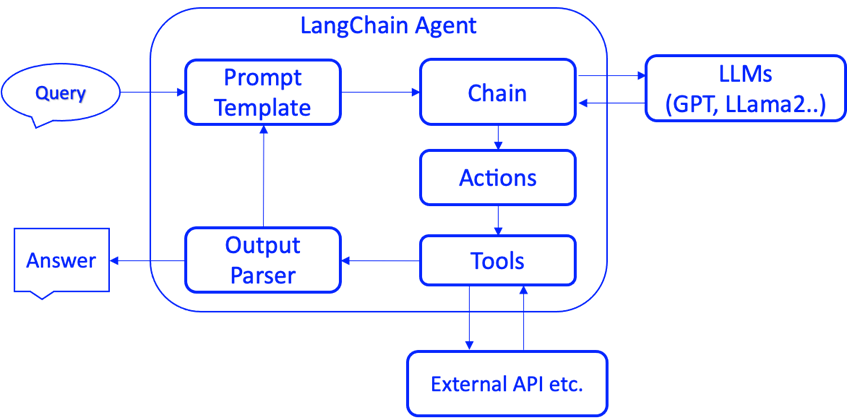

```go
// Model is an interface multi-modal models implement.
type Model interface {
	// GenerateContent asks the model to generate content from a sequence of
	// messages. It's the most general interface for multi-modal LLMs that support
	// chat-like interactions.
	GenerateContent(ctx context.Context, messages []MessageContent, options ...CallOption) (*ContentResponse, error)
}

// Memory is the interface for memory in chains.
type Memory interface {
	// GetMemoryKey getter for memory key.
	GetMemoryKey(ctx context.Context) string
	// MemoryVariables Input keys this memory class will load dynamically.
	MemoryVariables(ctx context.Context) []string
	// LoadMemoryVariables Return key-value pairs given the text input to the chain.
	// If None, return all memories
	LoadMemoryVariables(ctx context.Context, inputs map[string]any) (map[string]any, error)
	// SaveContext Save the context of this model run to memory.
	SaveContext(ctx context.Context, inputs map[string]any, outputs map[string]any) error
	// Clear memory contents.
	Clear(ctx context.Context) error
}

// Tool is a tool for the llm agent to interact with different applications.
type Tool interface {
	Name() string
	Description() string
	Call(ctx context.Context, input string) (string, error)
}

```

**提示词模板（重点）**

和大模型交互的模板，大部分模型已经在预训练阶段都已经做过专门的适配，能够准确的理解和返回；

```plaintext
Assistant is a large language model trained by Meta.

Assistant is designed to be able to assist with a wide range of tasks, from answering simple questions to providing in-depth explanations and discussions on a wide range of topics. As a language model, Assistant is able to generate human-like text based on the input it receives, allowing it to engage in natural-sounding conversations and provide responses that are coherent and relevant to the topic at hand.

Assistant is constantly learning and improving, and its capabilities are constantly evolving. It is able to process and understand large amounts of text, and can use this knowledge to provide accurate and informative responses to a wide range of questions. Additionally, Assistant is able to generate its own text based on the input it receives, allowing it to engage in discussions and provide explanations and descriptions on a wide range of topics.

Overall, Assistant is a powerful tool that can help with a wide range of tasks and provide valuable insights and information on a wide range of topics. Whether you need help with a specific question or just want to have a conversation about a particular topic, Assistant is here to assist.

TOOLS:
------

Assistant has access to the following tools:

{{.tool_descriptions}}
```
```plaintext
To use a tool, please use the following format:

Thought: Do I need to use a tool? Yes
Action: the action to take, should be one of [{{.tool_names}}]
Action Input: the input to the action
Observation: the result of the action

When you have a response to say to the Human, or if you do not need to use a tool, you MUST use the format:

Thought: Do I need to use a tool? No
AI: [your response here]

```
```plaintext
Begin!

Previous conversation history:
{{.history}}

New input: {{.input}}

Thought:{{.agent_scratchpad}}
```

模板占位符

| 占位符 | 填充逻辑 |  |
| --- | --- | --- |
| {{.tool\_descriptions}} | `tool.Name(): tool.Description()` | 工具列表 |
| {{.tool\_names}} | `tool.Name()` | 工具列表 |
| {{.history}} | `memory.LoadMemoryVariables()` | 上下文记忆 |
| {{.input}} | 用户输入 |  |
| {{.agent\_scratchpad}} | LLM前置步骤处理结果（思路） | 工具返回结果 |

返回格式（协议）

约定大模型推理返回的消息格式，代码根据约定的格式解析下一步执行的动作，具体格式定义在`conversational_format_instructions.txt`中，比如：

*   文本返回：根据字符串前缀包含`AI:`
    

!!! note 模版
    Do I need to use a tool? No

    AI: "hello"

*   工具调用：根据**正则匹配**`Action`、`Action Input`关键词，**确定需要执行的Tool及其参数**
    

!!! note 模版
    Do I need to use a tool? Yes

    Action: 计算工具

    Action Input: hello

!!! note
    关于MCP的适配？

    可以考虑在提示词模板、工具调用这里来适配

    参考：[https://github.com/langchain-ai/langchain-mcp-adapters](https://github.com/langchain-ai/langchain-mcp-adapters)

**链式调用**

在需要调用工具的情况下，一般需要多次调用LLM来生成最终的返回，此流程通过链式调用的方式实现；

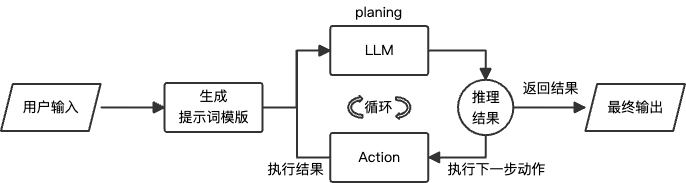

```go
steps := make([]schema.AgentStep, 0)// 链式调用结果
for i := 0; i < e.MaxIterations; i++ {
    var finish map[string]any
    // 循环调用
    steps, finish, err = e.doIteration(ctx, steps, nameToTool, inputs)
    if finish != nil || err != nil {
        return finish, err
    }
}
```
> [Dify实现](https://github.com/langgenius/dify/blob/main/api/core/agent/cot_agent_runner.py#L89)

#### Workflow

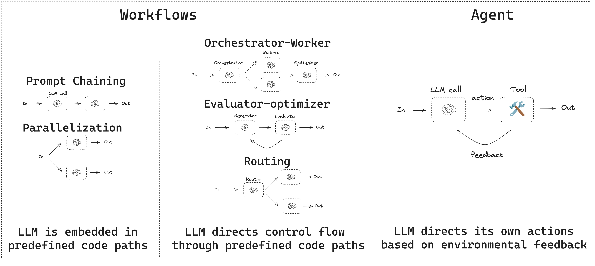

工作流是通过预定义的代码路径来协调 LLMs 和工具的系统，Agent则是通过LLMs 动态地控制自己的流程和工具使用，控制任务的完成。[参考](https://langchain-ai.github.io/langgraph/tutorials/workflows/)

##### 工程实现

:::
参考的是[Dify](https://github.com/langgenius/dify/blob/main/api/core/workflow/graph_engine/graph_engine.py#L146)，其他的框架可以参考[langgraph](https://github.com/langchain-ai/langgraph/blob/062253fe483f041cf7556bcffecb2216412d315f/libs/langgraph/langgraph/pregel/__init__.py#L2181C9-L2181C15)、aimap，大部分都是基于流程引擎来实现的；
:::

**图（Graph）定义**

```go
class Graph(BaseModel):
    root_node_id: str = Field(..., description="root node id of the graph")
    node_ids: list[str] = Field(default_factory=list, description="graph node ids")
    node_id_config_mapping: dict[str, dict] = Field(
        default_factory=list, description="node configs mapping (node id: node config)"
    )
    edge_mapping: dict[str, list[GraphEdge]] = Field(
        default_factory=dict, description="graph edge mapping (source node id: edges)"
    )
```

**节点（Node）**

```go
class BaseNode(Generic[GenericNodeData]):
@abstractmethod
    def _run(self) -> NodeRunResult | Generator[Union[NodeEvent, "InNodeEvent"], None, None]:
        """
        Run node
        :return:
        """
        raise NotImplementedError
```

各类型节点实现：

[https://github.com/langgenius/dify/tree/main/api/core/workflow/nodes: https://github.com/langgenius/dify/tree/main/api/core/workflow/nodes](https://github.com/langgenius/dify/tree/main/api/core/workflow/nodes)

**边（GraphEdge）**

```python
class GraphEdge(BaseModel):
    source_node_id: str = Field(..., description="source node id")
    target_node_id: str = Field(..., description="target node id")
    run_condition: Optional[RunCondition] = None
    """run condition"""
```

**流程引擎（Engine）**


```python
next_node_id = start_node_id

while True:
  node_config = self.graph.node_id_config_mapping.get(node_id)
  node_instance = node_cls(node_config...)
  _run_node(node_instance)
  generator = node_instance.run()
  edge_mappings = self.graph.edge_mapping.get(next_node_id)
  if len(edge_mappings) == 1:
    // 非条件
  else:
    // 条件判断
    if any(edge.run_condition for edge in edge_mappings):

```
> 源码实现：[‎GraphEngine.\_run](https://github.com/langgenius/dify/blob/main/api/core/workflow/graph_engine/graph_engine.py#L224)

#### 其他基础能力

比如RAG、工具、日志、应用发布等配套的能力；

### 流程建设（LLMOps）

**LLMOps**：涵盖了大型语言模型（如GPT系列）**开发、部署、维护和优化的一整套实践和流程**；LLMOps 的目标是确保高效、可扩展和安全地使用这些强大的 AI 模型来构建和运行实际应用程序。它涉及到模型训练、部署、监控、更新、安全性和合规性等方面；

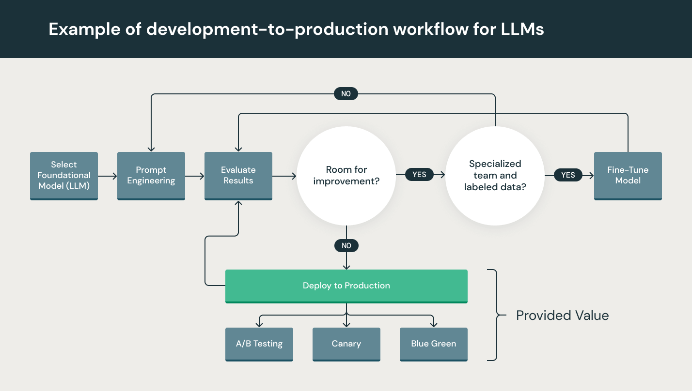

> [https://www.databricks.com/glossary/llmops](https://www.databricks.com/glossary/llmops)

## 附录

开源仓库：

机器学习专业术语：[https://developers.google.com/machine-learning/glossary/fundamentals?hl=zh-cn](https://developers.google.com/machine-learning/glossary/fundamentals?hl=zh-cn)

文档：

[https://github.com/liguodongiot/llm-action](https://github.com/liguodongiot/llm-action)

[https://github.com/luhengshiwo/LLMForEverybody](https://github.com/luhengshiwo/LLMForEverybody)